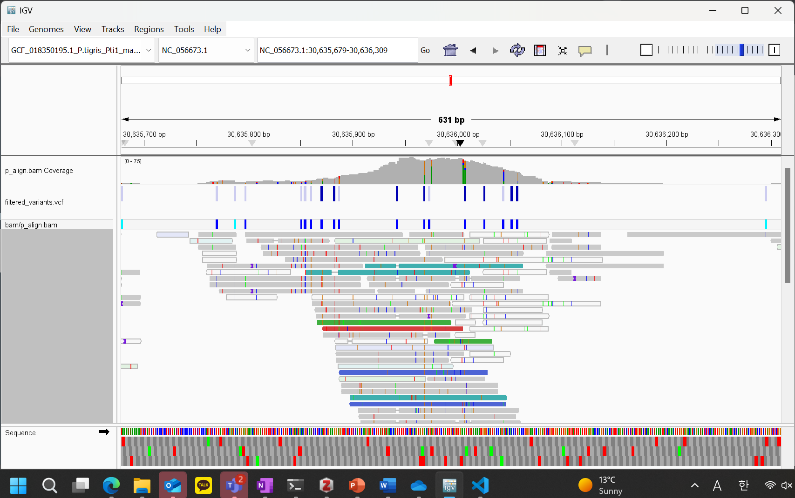
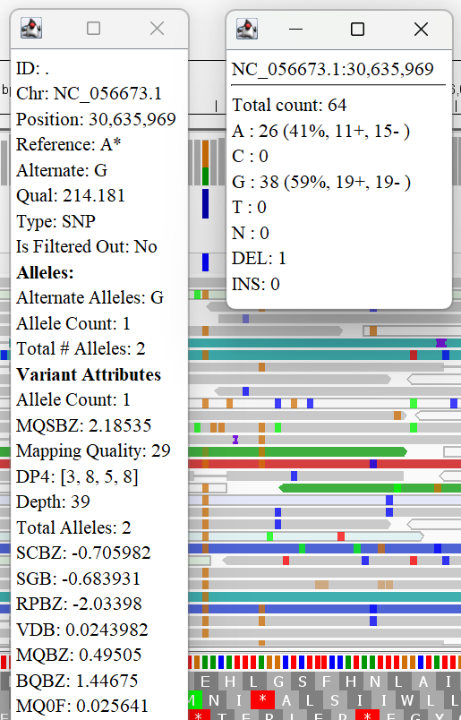
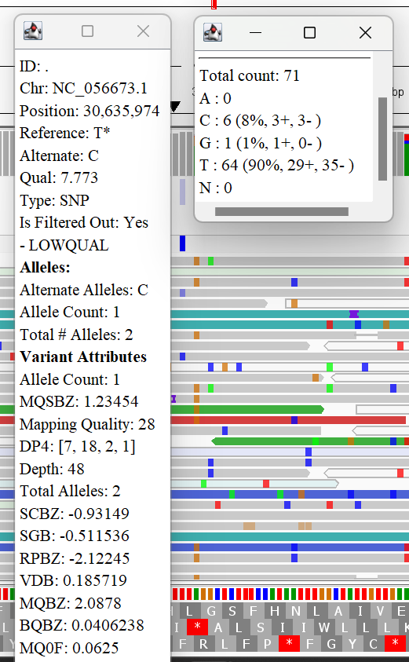

# In which we try to look at some variants

Added a new command to the makefile that will create a file containing variants and filter it out for quality

```bash
variant:
	mkdir -p variants
	bcftools mpileup -f ${GENOME} bam/${BAM} | bcftools call -mv -Oz -o variants/variants.vcf.gz
	bcftools filter -s LOWQUAL -e 'QUAL<20 || DP<10' variants/variants.vcf.gz > variants/filtered_variants.vcf
```

After using this command I put the file into IGV, giving me this



Let's take a look at some of the variants it found in this area!


This one has a depth of 36 with quality of 102.273.
The reference genome has a T at this location but there is 1 read containing A and 23 reads containing C in my data. I am enclined to believe that the A is due to an error on the sequencer machine and that there is a variant here that contains C instead of T. 
Also, there are only 5 reads with deletions so this probably does not an indicate an indel but also an error during sequencing.



This one has a depth of 39 with quality of 214.181.
The reference genome has a A at this location but there are 38 reads containing G in my data. This is 59% of the total reads so there is likely a variant here that contains G instead of A. 
Also, there is only 1 read with a deletions so this probably does not an indicate an indel but also an error during sequencing.



This is likely a false positive as it was filtered out by my code. Not only are there very few variant reads at 6 C's and 1 G as opposed to 64 T's (the reference), but the quality is a miserable 7.773 at this location which increases the likelihood of this being a false positive result.


not sure which could be false negatives but the quality or depth cutoff for the filtering of base quality and/or read depth may be too strict for some of the colored bars in the coverage track that don't have any variant calls through my code.