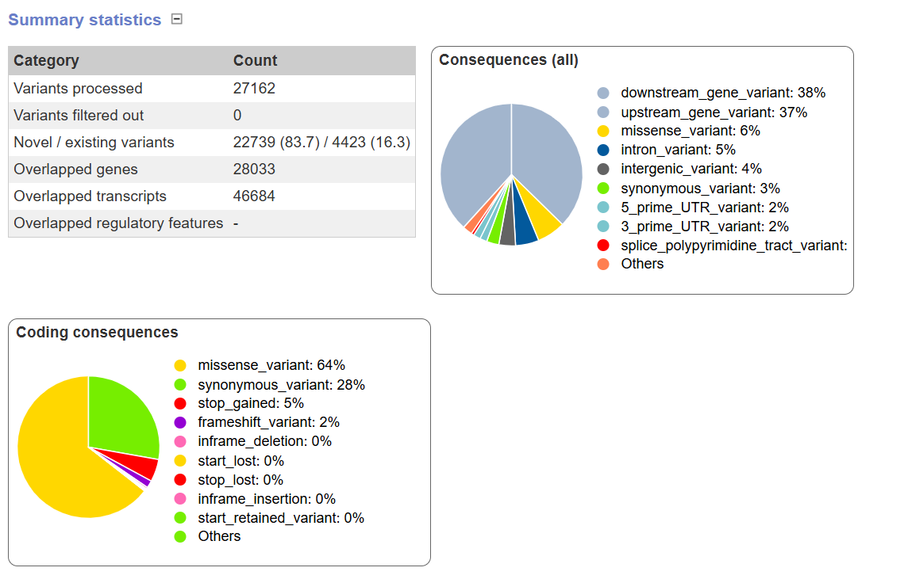

# In which I use VEP (and fail)

Added a new command to the makefile that will do the necessary steps to run VEP

```bash
# VEP needs a sorted and compressed GFF file
gffsort:
	cat ${GFF} | sort -k1,1 -k4,4n -k5,5n -t$$'\t' | bgzip -c > ${GFF}.gz
	tabix -p gff ${GFF}.gz

# VEP is installed in the environment called vep
vep: ${GFF}.gz
	mkdir -p results
	micromamba run -n vep \
		~/src/ensembl-vep/vep \
		-i ${VCF} \
		-o results/vep.txt \
		--gff ${GFF}.gz \
		--fasta ${REF} \
		--force_overwrite 

	# Show the resulting files
	ls -lh results/*
```

However, after 10 HOURS of trying multiple genomes, and multiple flags, and still getting shitty results I give up and move on.

It was giving results such as everything being labeled as SNVs, or every line being skipped for VEP despite doublechecking that the vcf gff gtf and ref files had the same chromosome names.

Here's the results from the VEP web version for arabidopsis thaliana



looks like downstream and upstream variants are most common.

within the coding consequences, they're mostly missense variants and synonymous variants.

thank you and goodnight.

