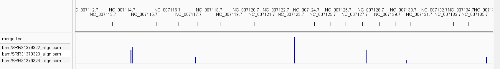
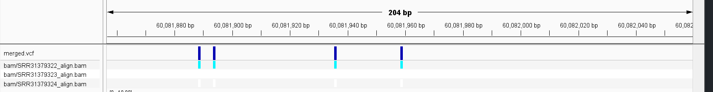

# Parallel processing and merging vcfs

I decided to look at zebrafish because why not?

First thing was to create a design.csv file as following
```bash
sample_id,accession
Sample_1,SRR31379322
Sample_2,SRR31379323
Sample_3,SRR31379324
```

Then I made a shell file that would let me use the .csv to run my makefile
```bash
#!/bin/bash
set -x
set -e
sample_id=$1
accession=$2
# Run the Makefile with the sample-specific parameters
make genome index
make all SAMPLE_ID=$sample_id SRR=$accession
```

Then I had to make it executable with
```bash
chmod +x run_makefile.sh
```

And the command to run this all in parallel was
```bash
$ tail -n +2 design.csv | parallel -j 6 --colsep ',' ./run_makefile.sh {1} {2} 
```

Note of caution: this may have memory issues during alignment depending on how fancy your PC is.

Once that was finished I indexed the vcf files and merged them with
```bash
bcftools index variants/SRR31379322_variants.vcf
bcftools index variants/SRR31379323_variants.vcf
bcftools index variants/SRR31379324_variants.vcf

bcftools merge -Oz -o merged.vcf.gz variants/SRR31379322_variants.vcf variants/SRR31379323_variants.vcf variants/SRR31379324_variants.vcf
```

When I put the merged file into IGV, it looked like this.
So probably not enough coverage but I don't want to melt my poor laptop.


If you look a bit closer at the first variant,


So we do have something but only in two of the SRR files I called!

I do note that I have absolutely no idea if this is accurate or not because attempting to open my vcf files looks something like this.
```bash
‹     ÿ BC ¶(­}ËέÇqÝ\OA„ÃXdwÝ+
```


