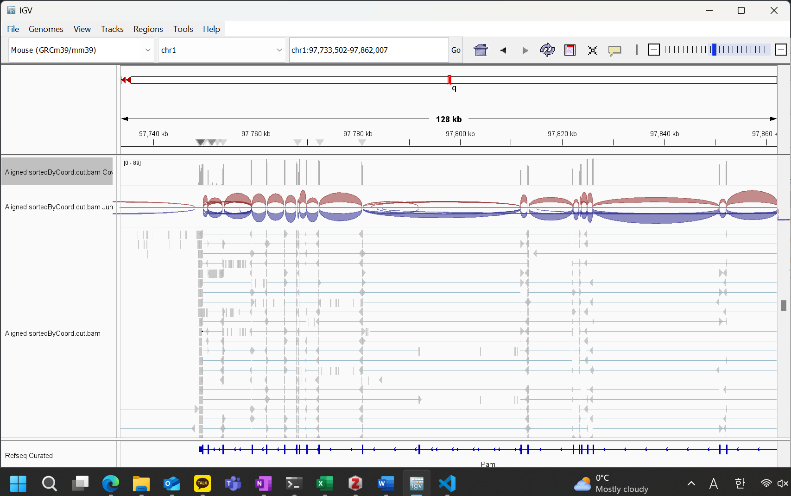
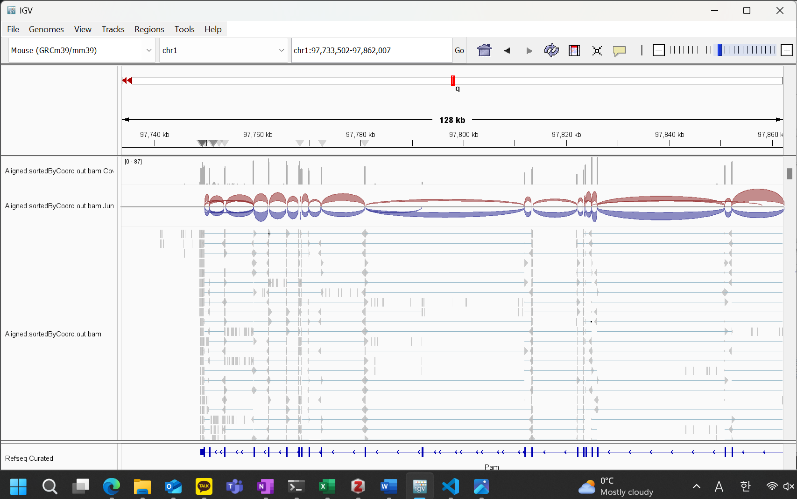
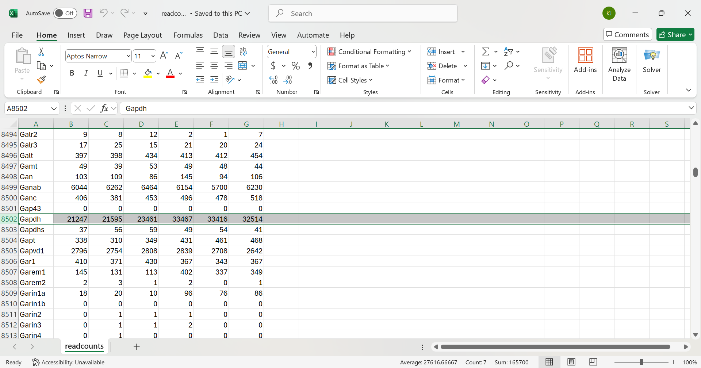
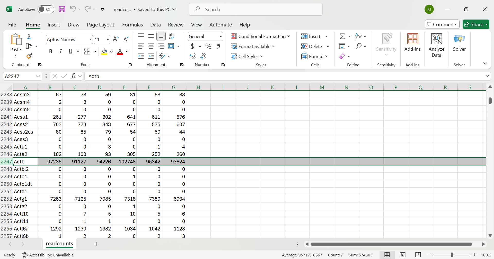

# In which I rehash the RNAseq I did a month ago

Luckily I am prepared for this assignment as I performed my own RNAseq analysis on samples in our lab last month.

The scripts have been changed so the makefile can use them.\
These were originally run on ROAR so I can't actually completely test on my potato as it lacks the processing power. 

The rnaseq_workshop environment in the scripts needs the latest versions of
1. fastqc\
2. Trim Galore!\
3. STAR\
4. HTseq\
5. Samtools\
6. pigz\

The directories need to be setup as 
```bash
/00-rawreads
/01-trimmedreads
/02-alignments
/03-readcounts
/Genome
```

The files numbering 00 to 02 also need an additional text file containing the names of the samples.
```bash
samples.txt
```

Then to download my different SRR files, I had to create a design.csv file as following
```bash
sample_id,accession
SEEM_WT1,SRR17145315
SEEM_WT2,SRR17145316
SEEM_WT3,SRR17145317
SEDM_WT1,SRR17145309
SEDM_WT2,SRR17145310
SEDM_WT3,SRR17145311
```

Then I made a shell file that would let me use the .csv to run my makefile
```bash
#!/bin/bash

set -x
set -e

sample_id=$1
accession=$2

# Run the Makefile with the sample-specific parameters
make download SAMPLE_ID=$sample_id SRR=$accession
```

Then I had to make it executable with
```bash
chmod +x run_makefile.sh
```

And the command to run this all in parallel was
```bash
$ tail -n +2 design.csv | parallel -j 6 --colsep ',' ./run_makefile.sh {1} {2} 
```

After downloading the genome files using *downloadgenome* and the srr files using the run_makefile.sh, we can run the makefile commands *index*, *trim*, *align*, and *htseq*.\
I am using the mm39 genome and custom SRR files from our lab.

Before running the final *counttable* command there must be a design table file.

To visualize the RNAseq data in IGV, we must index the bam files for each sample in /02-alignments using
```bash
samtools index ${filename}
```

Comparing two different samples from different conditions in IGV looks like this.



We know that this is RNAseq data because only the exons have coverage.\
At least in the region that these images show, there is only a small bit of difference in the coverage so this is probably not a DEG.

I tried to look for stably expressed genes in the count matrix by looking at housekeeping genes.\

Surprisingly Gapdh, a gene involved in glycolysis, is not stable.\
This indicates that this glycolysis is probably increasing in the last 3 samples, indicating metabolic flux.


Another housekeeping gene, beta-actin is more stably expressed across the samples, which probably makes it a better housekeeping gene compared to Gapdh.