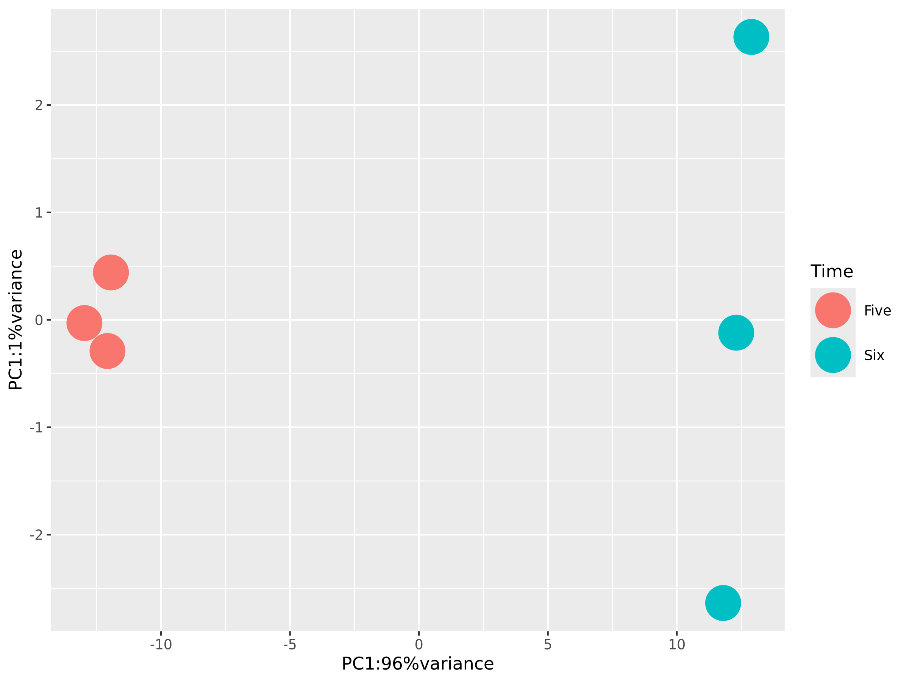
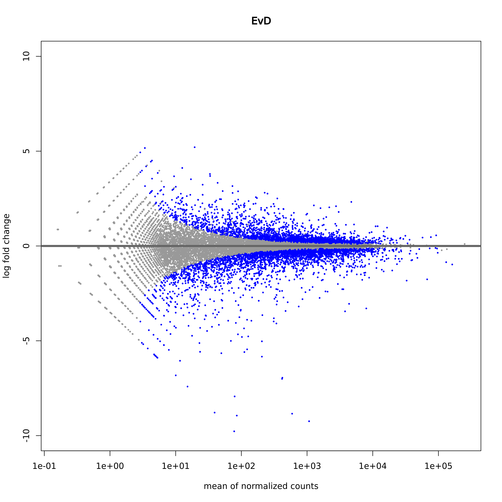
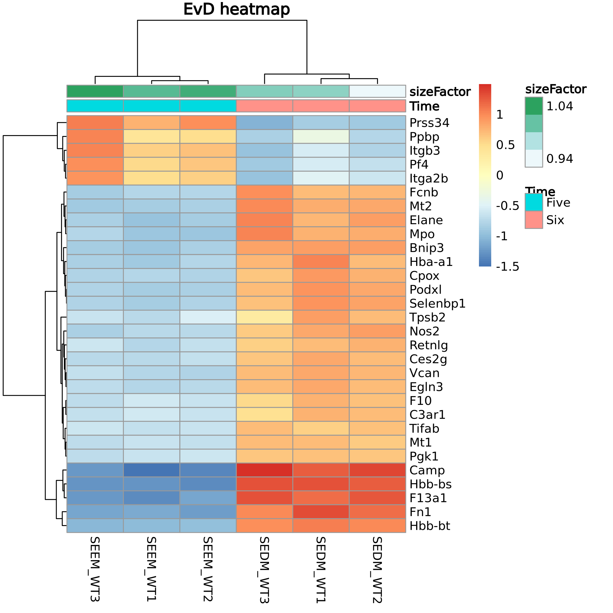

# Analyzing RNAseq data through DESeq2

I took feedback from my previous homework and adjusted the makefile to make it more user-friendly.

The conda environment requires\
1. fastqc\
2. Trim Galore!\
3. STAR\
4. HTseq\
5. Samtools\
6. pigz\

The SRR files must still be downloaded with the following command if you don't want to do it manually.
```bash
tail -n +2 acc_ids.csv | parallel -j 6 --colsep ',' ./run_makefile.sh {1} {2} 
```

While all the makefile commands should work, it probably wont on personal computers due to memory issues when indexing and aligning.

The stats environment for R will also need an additional package: pheatmap.

After the deseq2 command is run, it will generate two folders that respectively contain the resulting .csv files and the plot images.

To explain the samples in the context of the experiment, these are mouse primary bone marrow cells grown in vitro specifically to mimic stress erythropoiesis in mice.\
The cultures allow for the enrichment and development of stress erythroid progenitor cells.\
SEEM samples are cultured in an "Expansion" focused media while SEDM samples are cultured in an "Differentiation" focused media after the expansion phase.

Part of the results include the
```bash
print(summary(degs))
```
command which will give a summary of the DEGs, for which the criteria is having an adjusted p-value under 0.05 and a log2 fold change over 1.\
In this case, it prints out
```bash
out of 1163 with nonzero total read count
adjusted p-value < 0.1
LFC > 0 (up)       : 746, 64%
LFC < 0 (down)     : 417, 36%
outliers [1]       : 0, 0%
low counts [2]     : 0, 0%
(mean count < 3)
```
This means I have 1163 total DEGs, of which 64% are upregulated in SEDM culture and 36% downregulated.


As the PCA plot shows, there is a clear difference between the DEGs of the SEEM samples and the SEDM samples.


The MA plot shows blue dots as significant results.\
The X axis represents the expression level of the genes while the Y axis shows the expression difference between SEEM and SEDM.\
As the overall shape looks standard that the majority of genes are not DEGs (near the top right or bottom right), the quality of the RNAseq analysis seems alright in that regard.


The heatmap takes the 30 most differentially expressed DEGs and plot their expression level across the samples.\
Some of the interesting results I can see that are upregulated right off the bat are Cpox, Selenobp1, and Nos2.

Cpox is a well known enzyme important for heme biosynthesis, so it makes sense that it is upregulated in differentiating stress erythroid progenitors.\
Selenobp1 is a selenium binding protein, and one of my labmates works on how selenoproteins affect stress erythroipoiesis.\
Nos2 is nitric oxide synthase, which our lab thinks is important for proper proliferation.\
However, these results show the opposite of another experiment done by a former lab member, who saw expression decrease in SEDM when doing RTqPCR.\
So I'm not sure why this is being upregulated in SEDM here, considering that this is their RNAseq data...

The 5 downregulated genes mostly seem to be involved in platelets, so I am not sure what that means.\
It is important to note that these cultures are not *pure* cultures because they contain macrophages and other bone-marrow stem cell derived cells as well, which could explain some of the discrepancies.