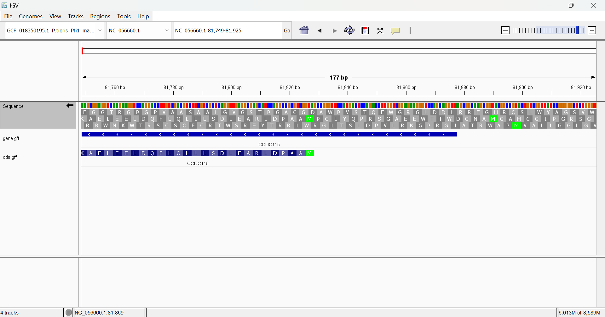
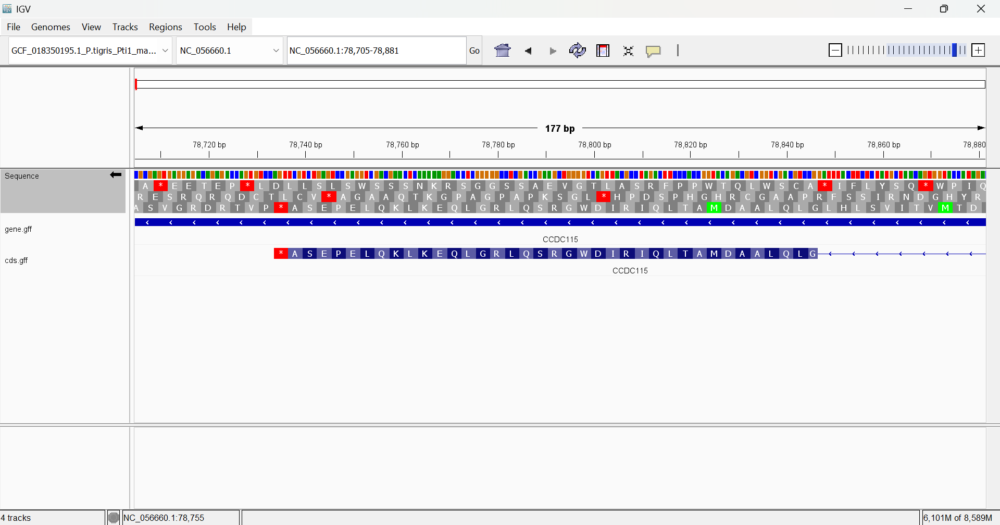
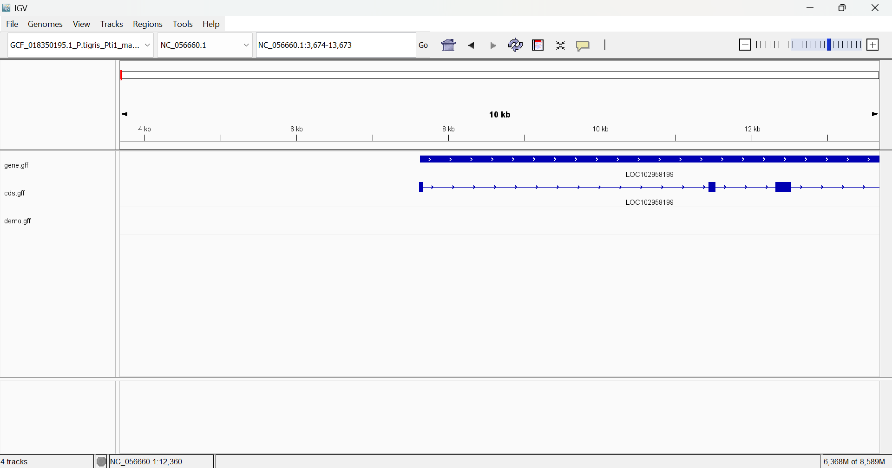
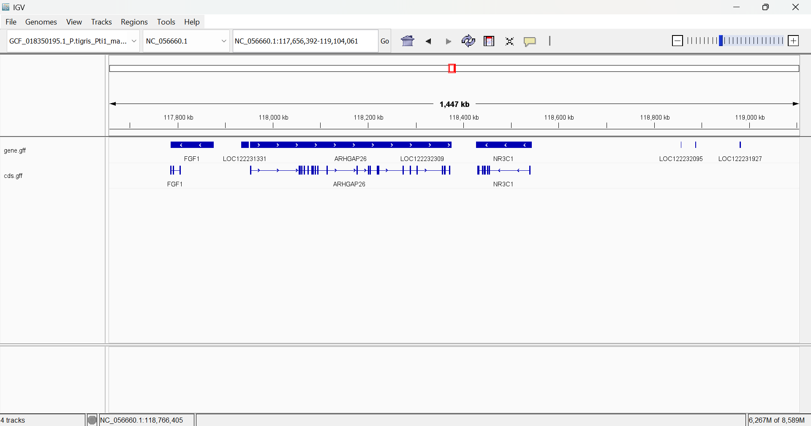

#This markdown file shows how I visualized GFF files

**Downloading genome and files**

```bash
datasets download genome accession GCF_018350195.1 --include gff3,cds,protein,rna,genome
```

**Unzipping**

```bash
unzip ncbi_dataset.zip
```

I attempted to open genomic.gff in IGV but it forced to sort the file, creating genomic.sorted.gff

**Extracting genes**

```bash
cat ncbi_dataset/data/GCF_018350195.1/genomic.sorted.gff | awk ' $3=="gene" { print $0 }' > ncbi_dataset/data/GCF_018350195.1/gene.gff
```

This should give a file named gene.gff

**Extracting CDS**

```bash
cat ncbi_dataset/data/GCF_018350195.1/genomic.sorted.gff | awk ' $3=="CDS" { print $0 }' > ncbi_dataset/data/GCF_018350195.1/cds.gff
```

This should give a file named cds.gff

**Visualizing gene and CDS files**

Drag both of the above files onto your IGV window and zoom in and you should get something like this!





As we can see, the start and stop codons align pretty well with the amino acids!

Hopefully yours does too

**Creating your very own gff file**

Create a gff file with the following content

```bash
NC_056660.1	.	CDS	6000	7000	.	+	.	Parent=transcript1;ID=cds1
NC_056660.1	.	CDS	8500	9500	.	-	.	Parent=transcript1;ID=cds2
```

Make sure you're looking at the right chromosome

Now drag it onto the IGV window and.....*TADA*




