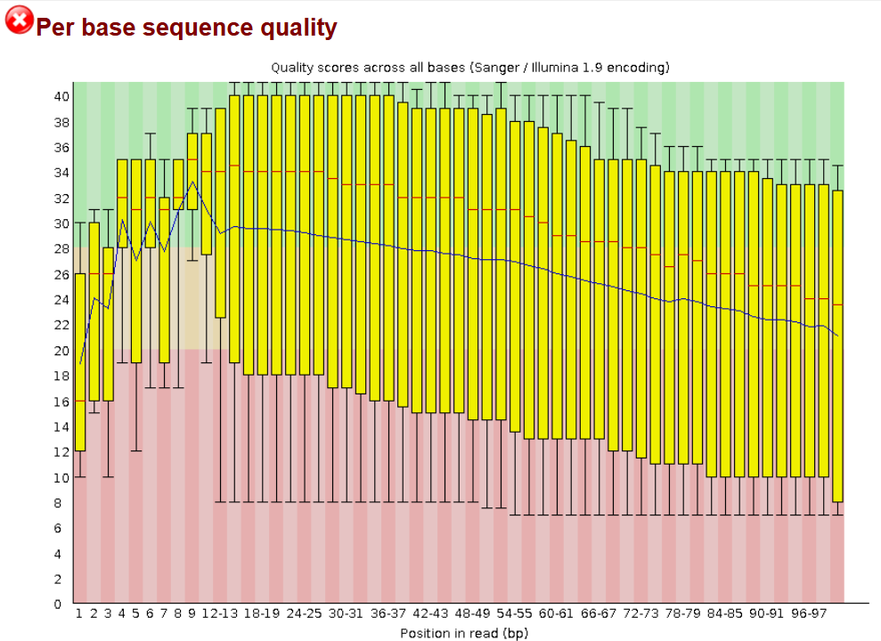
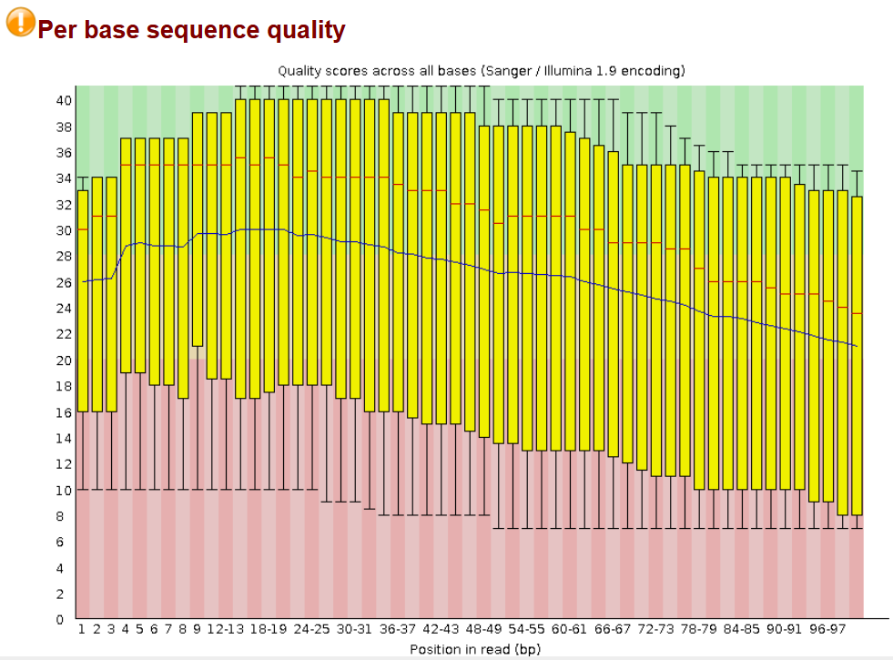
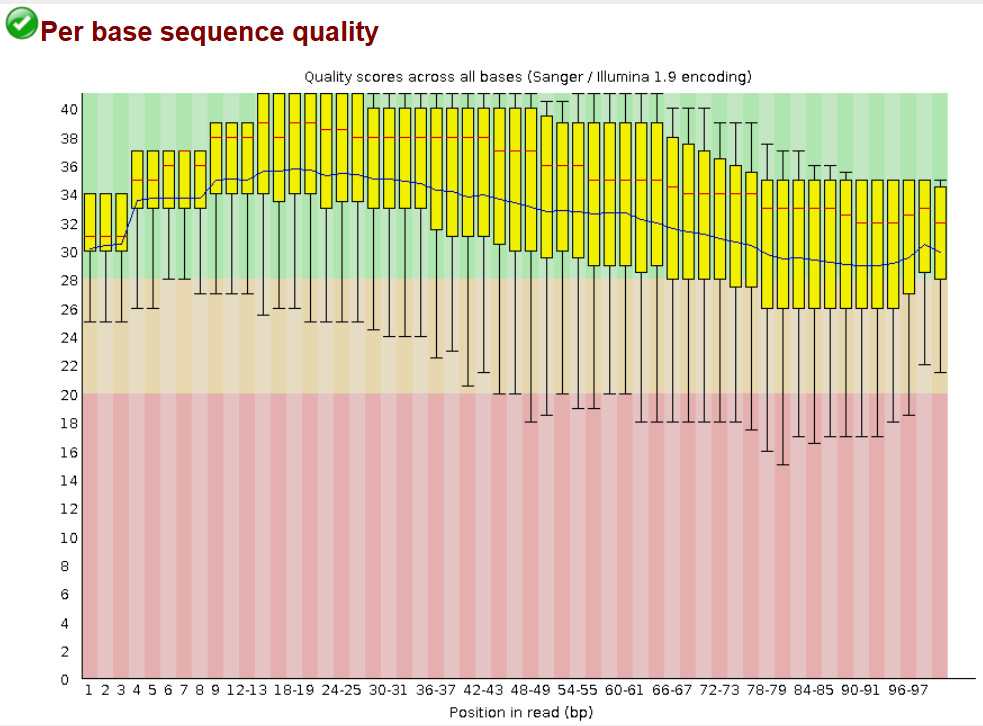

# Getting SRA files and assessing quality

**Part 1: The Basics**

Set trace to check for errors
```bash
set -uex
```

Set your variables
```bash
#Set SRR
srr="SRR639755"

#Set number of reads
N=10000

#Set output read names
r1=reads/${srr}_1.fastq
r2=reads/${srr}_2.fastq

#Set trimmed read names
t1=reads/${srr}_1.trimmed.fastq
t2=reads/${srr}_2.trimmed.fastq

#Set adapter sequence
ADAPTER=AGATCGGAAGAGCACACGTCTGAACTCCAGTCA

#Set read directory
rdir=reads

#Set report directory
pdir=reports
```

The actual commands

These commands makes the proper directories, downloads the srr file, and runs fastqc
```bash
#Make directories
mkdir -p ${rdir} ${pdir}

#Download data from SRA
fastq-dump -X ${N} -F --outdir reads --split-files ${srr}

#Run FastQC
fastqc -q ${r1} ${r2} -o ${pdir}
```

**Part 2: Getting better quality reads**

After going through 12 different SRR files to try and find one with bad quality...

SRR1


SRR2


We run fastp to trim the adapters off and see if it gives us better quality
```bash
#QC Trimming
fastp --adapter_sequence=${ADAPTER} --cut_tail \
      -i ${r1} -I ${r2} -o ${t1} -O ${t2}

#Run FastQC on trimmed reads
fastqc -q -o ${pdir} ${t1} ${t2}
```

Check if the new quality is better

SRR1 post-trim


SRR2 post-trim


YAY

We see that the quality has improved significantly so that it is probably usable enough for downstream applications

Assuming that the environment menv has been created you can also create a multiqc report like this
```bash
micromamba run -n menv multiqc -o ${pdir} ${pdir}
```