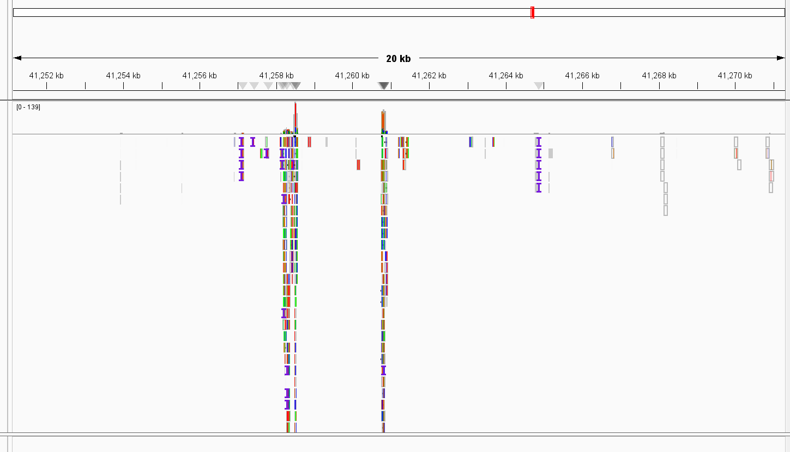
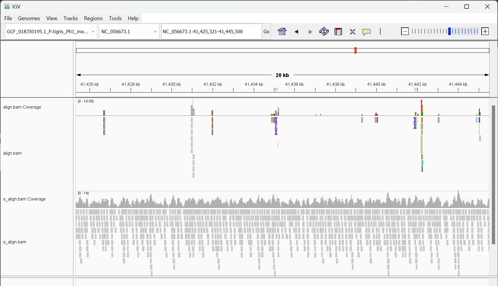

# In which we edit our makefile from HW7 to add options to index and align

The additional variables are as follows:

```bash
#Set reference genome
REF=refs/${CHR}.fa
#Set SAM file name
SAM=align.sam
#Set BAM file name
BAM=align.bam
```

We also update our usage command to include the following:

```bash
@echo "make index     # Index the reference genome"
@echo "make align     # Align the reads to the reference genome"
```

The index command indexes the reference genome.

```bash
index:
	bwa index ${REF}
```

And the align command aligns the reads to the reference genome.

```bash
align:
	mkdir -p bam
	bwa mem ${REF} ${t1} > bam/${SAM}
	cat bam/${SAM} | samtools sort > bam/${BAM}
	samtools index bam/${BAM}
```

To create a simulated bam file as well, instead of making a whole different command we can adjust the variables.

```bash
make -f HW8.mk align t1=reads/sim_read1.fq SAM=s_align.sam BAM=s_align.bam
```

When we put all of these into IGV, the best part of the alignment for the SRA file chosen looks like this.


And in comparison with the simulated reads, we can see how shit it is.


After comparing the two, I realized that this was because I purposefully chose the worst SRA file to try and improve the quality of for the previous assignment.

The simulated reads at 10x coverage have a very nice alignment with reads covering pretty much the entirety of the chromosome. 

However, the actual SRA data has very few reads, resulting in almost no coverage. 

There do seem to be a bit of colored lines, indicating a sequence variant. However, judging by the scarcity of coverage in the SRA alignment it is just as likely that it is just errors in the sequencing machine.

Using the following commands, we can observe the alignment statistics.

```bash
samtools flagstats bam/align.bam
```
```bash
2145685 + 0 in total (QC-passed reads + QC-failed reads)
2139900 + 0 primary
0 + 0 secondary
5785 + 0 supplementary
0 + 0 duplicates
0 + 0 primary duplicates
276284 + 0 mapped (12.88% : N/A)
270499 + 0 primary mapped (12.64% : N/A)
0 + 0 paired in sequencing
0 + 0 read1
0 + 0 read2
0 + 0 properly paired (N/A : N/A)
0 + 0 with itself and mate mapped
0 + 0 singletons (N/A : N/A)
0 + 0 with mate mapped to a different chr
0 + 0 with mate mapped to a different chr (mapQ>=5)
```
```bash
samtools flagstats bam/s_align.bam
```
```bash
3000000 + 0 in total (QC-passed reads + QC-failed reads)
3000000 + 0 primary
0 + 0 secondary
0 + 0 supplementary
0 + 0 duplicates
0 + 0 primary duplicates
3000000 + 0 mapped (100.00% : N/A)
3000000 + 0 primary mapped (100.00% : N/A)
0 + 0 paired in sequencing
0 + 0 read1
0 + 0 read2
0 + 0 properly paired (N/A : N/A)
0 + 0 with itself and mate mapped
0 + 0 singletons (N/A : N/A)
0 + 0 with mate mapped to a different chr
0 + 0 with mate mapped to a different chr (mapQ>=5)
```

As we can see, the SRA file in question only maps about 13% of the chromosome while the simulated reads maps the entire thing.